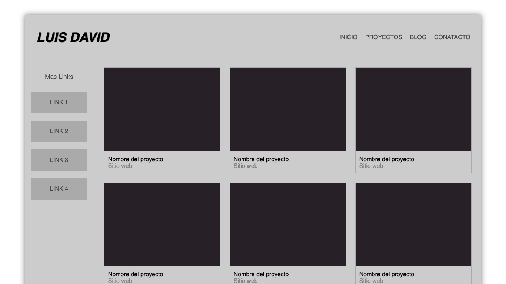

# Image Gallery

## Table of contents

- [Overview](#overview)
  - [The challenge](#the-challenge)
  - [Screenshot](#screenshot)
- [My process](#my-process)
  - [Built with](#built-with)
  - [What I learned](#what-i-learned)
  - [Continued development](#continued-development)
- [Author](#author)

## Overview

### The challenge

Users should be able to:

- View the page regardless of the device being used
- See an example image template
- See a navbar that contains no links
- View an address area that contains no links.

### Screenshot

## My process

### Built with

- HTML
- CSS
- CSS Flexbox

### What I learned

In this project I mainly learned to use the flexbox box design to make automatic sections that adapt to the page regardless of size, I also learned to apply styles such as box-shadow.

### Continued development

In the future, real images of any page or any API can be integrated to show the complete gallery, in addition to integrating pages by sections to make use of the links section.

## Author

Luis David Jimenez Martinez
- Portfolio - [www.luisdavidjm.com](https://www.luisdavidjm.com)
- GitHub - [LuisDavidJM](https://github.com/LuisDavidJM)
